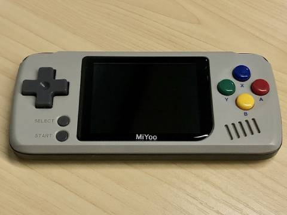

# Miyoo SDK
Docker environment for developing Miyoo Linux apps.

## Introduction
Miyoo is a handheld retro game emulator. It supports a variety of classic game emulators and indie games, which are generally based on the [SDL](https://www.libsdl.org/) framework:



This repo provides a battery included environment for compiling graphics apps on Miyoo. A [simplest demo app](./demo) is also available.

## Usage
Make sure you have [Docker](https://www.docker.com/) installed. Just init the environment with precompiled toolchain:

``` bash
cd MiyooSDK
wget http://fe-lab.gaoding.com/miyoo/toolchain.tar.gz

docker pull debian:9
docker build -t miyoo_sdk .
```

Then we have the `miyoo_sdk` docker image ready. We can try out the toolchain in terminal now:

``` bash
docker run -it --rm miyoo_sdk
```

Build demo app:

``` bash
cd demo

# Run make inside container
docker run -d --rm -v `pwd`:/home miyoo_sdk make
```

This should compile the `demo/demo.out` output, just copy this file to SD card, and start it from the App Installer on Miyoo. For a standalone icon entry, checkout the [GMenu2X](https://mtorromeo.github.io/gmenu2x/documentation/) documentation about using links.

> For multi app projects, this approach can be similarly applied to compile them separately. The image itself always remain clean and immutable after builds, which doesn't contradict to use build cache in your host FS.

## Credit
Toolchain courtesy of [Steward](https://github.com/steward-fu/) 🏅
